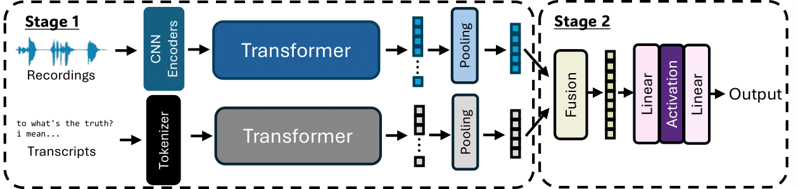

# biic_IS2025_SER_Challenge



This repository contains the official PyTorch implementation for our Interspeech 2025 paper:

"Lessons Learnt: Revisit Key Training Strategies for Effective Speech Emotion Recognition in the Wild"

ISCA Interspeech, Rotterdam, Netherlands, August 2025

## 🚀 Overview

We propose and evaluate practical strategies to improve Speech Emotion Recognition (SER) performance in the wild.

## 🛠️ Setup Instructions

### 1. Install Dependencies

`pip install -r requirements.txt`

### 2. Download Dataset

Download the MSP-Podcast dataset from official source and organize it according to your local path configuration.

### 3. Prepare Transcripts

- For training, use ground-truth transcripts.

- For development and testing, use automatic transcripts generated with `whisper-large-v3`.

### 4. Train Single-Modality Models

Train emotion recognition models separately for speech and text:

- Attribute Prediction

    - Speech: `train_eval_files/train_dim_ser.py`

    - Text: `train_eval_files/train_dim_ser_text.py`

- Categorical Prediction

    - Speech: `train_eval_files/train_cat_ser.py`

    - Text: `train_eval_files/train_cat_ser_text.py`

### 5. Extract Features

Use the scripts in the `feature_extractor/` directory to extract learned representations from trained unimodal models.

### 6. Train Multimodal Models

Train with both audio and text features:

- Attribute Prediction: `train_eval_files/train_dim_multi.py`

- Categorical Prediction: `train_eval_files/train_cat_multi.py`

## 📄 Citation
If you find this work useful in your research, please cite our paper:
```
@inproceedings{tzeng2025lessons,
  title={Lessons Learnt: Revisit Key Training Strategies for Effective Speech Emotion Recognition in the Wild},
  author={Jing-Tong Tzeng and Bo-Hao Su and Ya-Tse Wu and Hsing-Hang Chou and Chi-Chun Lee},
  booktitle={Proc. Interspeech},
  year={2025},
  address={Rotterdam, Netherlands}
}
```